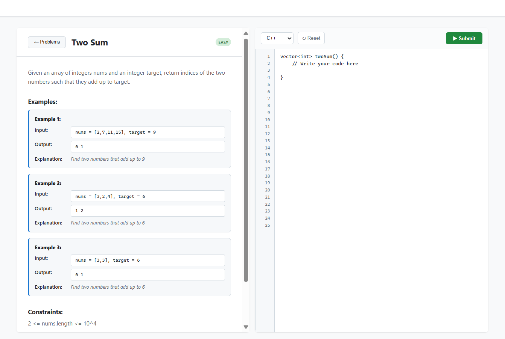

# 🏆 Code Master - Online Judge Platform

## 🎯 About The Project

**Code Master** is a modern, full-stack online judge platform that allows users to solve coding problems in multiple programming languages. It provides real-time code execution, comprehensive problem management, and detailed submission tracking - similar to LeetCode or HackerRank.

### 🌟 Why Code Master?

- **Multi-Language Support**: Write solutions in C++, Python, Java, and C
- **Real-Time Execution**: Instant code evaluation with detailed feedback
- **Professional UI/UX**: Clean, responsive interface built with React
- **Scalable Architecture**: Microservices architecture ready for production
- **Free to Use**: Deployed on free tier services, accessible to everyone

## ✨ Features

### 🔥 Core Features
- **Problem Solving**: Browse and solve coding challenges of varying difficulty
- **Code Editor**: Built-in code editor with syntax highlighting
- **Multi-Language Execution**: Support for C++, Python, Java, and C
- **Real-Time Testing**: Instant feedback with test case results
- **Submission Tracking**: Complete history of submissions with verdicts

### 📊 Platform Features
- **Problem Management**: CRUD operations for coding problems
- **Test Case Management**: Multiple test cases per problem with hidden cases
- **Statistics Dashboard**: Platform-wide statistics and analytics
- **Responsive Design**: Works seamlessly on desktop and mobile
- **RESTful API**: Well-documented API for all operations

### 🎨 User Experience
- **Clean Interface**: Modern, intuitive design
- **Fast Performance**: Optimized for speed and responsiveness
- **Error Handling**: Comprehensive error messages and graceful failures
- **Loading States**: Professional loading indicators and status updates

## 🛠️ Tech Stack

### Frontend
- **Framework**: React 18 with Vite
- **Routing**: React Router DOM
- **HTTP Client**: Axios
- **Styling**: CSS3 with Flexbox/Grid
- **Build Tool**: Vite
- **Deployment**: Render (Static Site)

### Backend
- **Runtime**: Node.js
- **Framework**: Express.js
- **Database**: MySQL 8.0
- **ORM**: mysql2 (Raw SQL)
- **Code Execution**: Judge0 API
- **CORS**: Enabled for cross-origin requests
- **Deployment**: Render (Web Service)

🪟 Run Code Master on Windows
📋 Prerequisites for Windows
1. Install Node.js
text
# Download and install Node.js from nodejs.org
# Choose LTS version (v18+)
# After installation, verify:
node --version
npm --version
2. Install MySQL
text
# Download MySQL Community Server from mysql.com
# During installation:
# - Set root password (remember it!)
# - Choose "Configure MySQL Server as Windows Service"
# - Start service automatically

# Verify installation:
mysql --version
3. Install Git (Optional)
text
# Download from git-scm.com or use GitHub Desktop
git --version
🚀 Setup Commands (Command Prompt/PowerShell)
1. Clone & Install Dependencies
text
# Clone project
git clone https://github.com/yourusername/code-master.git
cd code-master

# Install backend
cd server
npm install

# Install frontend
cd ..\client
npm install

# Go back to project root
cd ..
2. Setup MySQL Database
text
# Open MySQL Command Line Client (from Start Menu)
# OR use Command Prompt:
mysql -u root -p

# Enter your MySQL password, then run:
sql
CREATE DATABASE code_master_db;
USE code_master_db;

CREATE TABLE problems (
    id INT AUTO_INCREMENT PRIMARY KEY,
    title VARCHAR(255) NOT NULL,
    description TEXT,
    difficulty ENUM('Easy', 'Medium', 'Hard') DEFAULT 'Easy',
    created_at TIMESTAMP DEFAULT CURRENT_TIMESTAMP
);

CREATE TABLE test_cases (
    id INT AUTO_INCREMENT PRIMARY KEY,
    problem_id INT NOT NULL,
    input TEXT NOT NULL,
    expected_output TEXT NOT NULL,
    is_hidden BOOLEAN DEFAULT FALSE,
    FOREIGN KEY (problem_id) REFERENCES problems(id) ON DELETE CASCADE
);

CREATE TABLE submissions (
    id INT AUTO_INCREMENT PRIMARY KEY,
    problem_id INT NOT NULL,
    code TEXT NOT NULL,
    language VARCHAR(20) NOT NULL,
    verdict VARCHAR(50) DEFAULT 'Pending',
    runtime INT DEFAULT 0,
    created_at TIMESTAMP DEFAULT CURRENT_TIMESTAMP,
    FOREIGN KEY (problem_id) REFERENCES problems(id) ON DELETE CASCADE
);

-- Insert sample data
INSERT INTO problems (title, description, difficulty) VALUES 
('Two Sum', 'Find two numbers that add up to target', 'Easy'),
('Valid Parentheses', 'Check if parentheses are balanced', 'Easy');

INSERT INTO test_cases (problem_id, input, expected_output, is_hidden) VALUES
(1, '2 7 11 15\n9', '0 1', FALSE),
(2, '()', 'true', FALSE);

EXIT;
3. Create Environment Files
Create server\.env:

text
# In Command Prompt, go to server folder:
cd server
echo NODE_ENV=development > .env
echo PORT=5000 >> .env
echo DB_HOST=localhost >> .env
echo DB_USER=root >> .env
echo DB_PASSWORD=your_mysql_password >> .env
echo DB_NAME=code_master_db >> .env
echo DB_PORT=3306 >> .env
echo RAPIDAPI_KEY=your_judge0_key >> .env
Create client\.env:

text
# Go to client folder:
cd ..\client
echo VITE_API_URL=http://localhost:5000 > .env
echo VITE_ENVIRONMENT=development >> .env
4. Start the Application
Option 1: Two Command Prompt Windows

Window 1 - Backend:

text
cd server
npm start
Window 2 - Frontend:

text
cd client
npm run dev

Judge0 API integration for code execution

If you see connection errors, check that MySQL is running and credentials are correct in the .env files.

